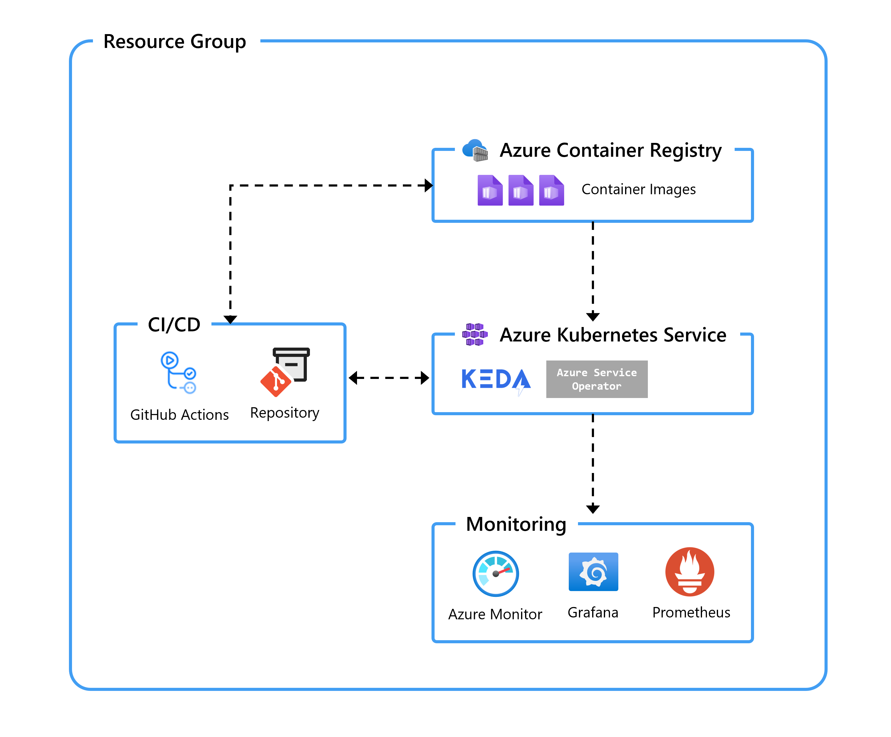

# Azure Developer CLI template: Base Azure Kubernetes Service (AKS) application



## Prerequisites

- [Azure CLI](https://learn.microsoft.com/cli/azure/install-azure-cli)
- [Azure Developer CLI](https://learn.microsoft.com/azure/developer/azure-developer-cli/install-azd)
- [Visual Studio Code](https://code.visualstudio.com/download)
- [AKS Developer Extension for Visual Studio Code](https://marketplace.visualstudio.com/items?itemName=ms-kubernetes-tools.aks-devx-tools)

## What is included in this repository

The repository hosts of the following components:

- Azure Developer CLI configuration
- Placeholder for an application `src\app\`

To understand more about the Azure Developer CLI architecture and to create a similar template, you can refer to [Make your project compatible with Azure Developer CLI](https://learn.microsoft.com/en-us/azure/developer/azure-developer-cli/make-azd-compatible?pivots=azd-create).

### Azure Developer CLI configuration

The template uses Bicep and the [Azure Developer CLI](https://learn.microsoft.com/azure/developer/azure-developer-cli/overview) (`azd`). The [azure.yaml](./azure.yaml) schema defines and describes the apps and types of Azure resources that are included in these templates.

The following infrastructure resources defined as Bicep templates in the `infra` folder are created:

- Azure Kubernetes Service (AKS) cluster
- Azure Container Registry
- Azure Managed Grafana
- Azure Monitor managed service for Prometheus

The template uses the following [event hooks](https://learn.microsoft.com/azure/developer/azure-developer-cli/azd-extensibility) to customize the workflow:

- [preprovision](./infra/azd-hooks/preprovision.sh) to make sure that all the required AKS features are registered.
- [predeploy](./infra/azd-hooks/predeploy.sh) to install additional cluster components (KEDA and Azure Service Operator).

## Initializing the template

If you are starting from this end state repo, use `azd init` to clone this template locally.

```sh
mkdir my-app
cd my-app
azd init -t https://github.com/sabbour/aks-app-template
```

## Deploying infrastructure

Deploy the infrastructure by running `azd provision`.

```sh
azd provision
```

You will be prompted for the following information:

- `Environment Name`: This will be used as a prefix for the resource group that will be created to hold all Azure resources. This name should be unique within your Azure subscription.
- `Azure Subscription`: The Azure Subscription where your resources will be deployed.
- `Azure Location`: The Azure location where your resources will be deployed.

You can monitor the progress in the terminal and on the Azure portal. After a few minutes, you should see the resources deployed in your subscription.


## Adding application source to placeholder folders

- You should put your source code in the `src\app\code` folder. You'll need to create a Dockerfile to containerize your application.
- You should put your Kubernetes manifests in the `src\app\manifests` folder.

You can use the [Azure Kubernetes Service developer extensions for Visual Studio code](https://marketplace.visualstudio.com/items?itemName=ms-kubernetes-tools.aks-devx-tools) to help with the Dockerfile and Kubernetes manifest generation.

## Deploying the application

Running `azd deploy` will build the applications defined in [azure.yaml](./azure.yaml) by running a Docker build then the Azure Developer CLI will tag and push the images to the Azure Container Registry. Each deployment creates a new image tag that is used during the token replacement.

```sh
azd deploy
```

Azure Developer CLI will also apply the Kubernetes manifests in the path configured in [azure.yaml](./azure.yaml). The `name` specified in [azure.yaml](./azure.yaml) will correspond to the Kubernetes namespace that will be created on the cluster where all resources will be deployed to.

While applying the manifests, the Azure Developer CLI will also perform a token replacement for the placeholders defined in the Kubernetes manifests to insert the container image location, Prometheus endpoint, and more.

The output variables of the Bicep template will also be created as Kubernetes secrets on the cluster.

## Continuous integration/continuous deployment

The workflow [azure-dev.yaml](./.github/workflows/azure-dev.yml) uses the Azure Developer CLI container image which has the CLI installed to login to the Azure environment with `azd login`, provision the infrastructure with `azd provision`, and deploy the application with `azd deploy`.

To configure the GitHub repository with the secrets needed to run the pipeline, you'll need to run `azd pipeline config`.

Since the infrastructure template requires setting up some role assignments, the created service principal will need to have `Owner` permissions on the resource group.

```sh
azd pipeline config --principal-role Owner 
```

Once you do so, and if you commit your changes, you should see the pipeline running to build and deploy your application.

## Clean up

To clean up resources that were deployed to your subscription, run `azd down`.
